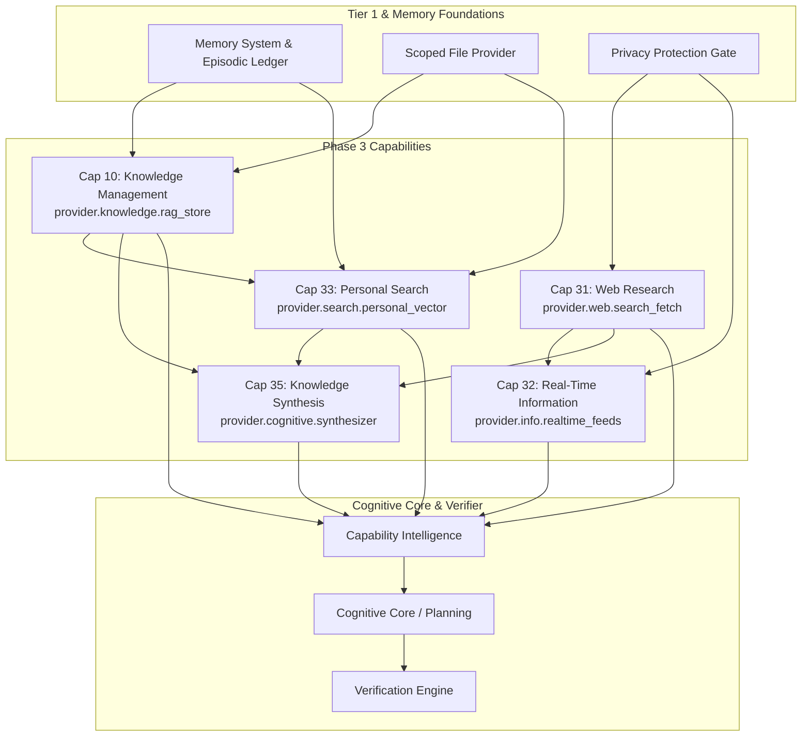

# PHASE 3 — INFORMATION, KNOWLEDGE & RESEARCH ARCHITECTURE & IMPLEMENTATION PLAN
## Capabilities: 10 (Knowledge Management), 31 (Web Research), 32 (Real-Time Information), 33 (Personal Search), 35 (Knowledge Synthesis)

**Status:** ARCHITECTURE & IMPLEMENTATION PLAN (PRE-EXECUTION)  
**Author:** Principal Architect & Implementation Engineer  
**Date:** 2026-09-15  
**Readiness Gate:** Phase 2 FROZEN / COMPLETE  

---

## 1. REPOSITORY AUDIT & EXISTING FUNCTIONALITY

A rigorous inspection of the current repository revealed extensive pre-existing functionality that must be preserved, wrapped, and unified under the Capability Architecture rather than rebuilt.

| Existing Module | Current Responsibility | Reusability / Target Capability | Classification |
|---|---|---|---|
| [`agents/personal_knowledge_base.py`](file:///d:/assignment/JARVIS/agents/personal_knowledge_base.py) | Manages JSON note records in `data/knowledge_base/`, maintains `index.json`, tags, and syncs to vector store. | Wrap for **Capability 10** (`knowledge.ingest`, `knowledge.index`, `knowledge.query`) and **Capability 33** (`search.personal_vector`). | **PARTIAL** |
| [`agents/semantic_rag.py`](file:///d:/assignment/JARVIS/agents/semantic_rag.py) | 384-dimensional continuous float32 vector embedding generator (`LocalSemanticEmbedding`) and SQLite vector store (`LocalVectorStore`). | Core foundation for **Capability 10, 33, and 35**. 100% offline, CPU-friendly. | **PARTIAL** |
| [`agents/web_agent.py`](file:///d:/assignment/JARVIS/agents/web_agent.py) | Multi-provider web search (Tavily, Brave, DuckDuckGo) with India localization and PrivacyProtection sanitization. | Wrap for **Capability 31** (`search.web`, `web.fetch`). | **PARTIAL** |
| [`skills/web_skills.py`](file:///d:/assignment/JARVIS/skills/web_skills.py) | Free-first skills: `DuckDuckGoSearchSkill`, `WikipediaSearchSkill`, Open-Meteo `WeatherSkill`. | Wrap for **Capability 31** (free web fallback) and **Capability 32** (weather). | **EXISTING** |
| [`agents/weather_agent.py`](file:///d:/assignment/JARVIS/agents/weather_agent.py) | Wraps Open-Meteo free API for global & Indian weather data. | Integrate into **Capability 32** (`info.get_weather`). | **EXISTING** |
| [`agents/news_agent.py`](file:///d:/assignment/JARVIS/agents/news_agent.py) | Fetches latest topic-based news using WebAgent search with India localization. | Integrate into **Capability 32** (`info.get_news`). | **EXISTING** |
| [`agents/wikipedia_agent.py`](file:///d:/assignment/JARVIS/agents/wikipedia_agent.py) | Free encyclopedia definitions and lookups via Wikipedia REST API. | Ingest into **Capability 31** and **Capability 35**. | **EXISTING** |
| [`memory/episodic_memory.py`](file:///d:/assignment/JARVIS/memory/episodic_memory.py) | 7-tier memory system with episodic interaction history ledger. | Ingest into **Capability 33** (`search.interaction_history`) and **Capability 35** (synthesis). | **EXISTING** |
| [`capabilities/providers/search_provider.py`](file:///d:/assignment/JARVIS/capabilities/providers/search_provider.py) | Phase 1 wrapper around WebAgent. | Expand into unified multi-source research provider for **Capability 31**. | **PARTIAL** |
| [`cognitive/reasoning.py`](file:///d:/assignment/JARVIS/cognitive/reasoning.py) | Deliberative reasoning engine. | Synthesis reasoning core for **Capability 35** (`synthesis.combine_sources`). | **FOUNDATION** |

---

## 2. CAPABILITY CLASSIFICATION (10, 31, 32, 33, 35)

1. **Capability 10: Knowledge Management — `PARTIAL`**
   - *Existing:* Note storage, JSON index, SQLite vector persistence.
   - *Missing:* Standardized provider contract (`provider.knowledge.rag_store`), operations (`knowledge.ingest`, `knowledge.index`, `knowledge.query`, `knowledge.audit_freshness`), empirical index verification, deduplication hashing.
2. **Capability 31: Web Research — `PARTIAL`**
   - *Existing:* Multi-engine search (Tavily, Brave, DDG), URL page fetching, privacy masking.
   - *Missing:* Multi-source citation synthesis (`search.synthesize_citations`), credibility ranking, domain allowlisting, verification strategy `HTTP_RESPONSE_AND_CITATION_MATCH`.
3. **Capability 32: Real-Time Information — `PARTIAL`**
   - *Existing:* Open-Meteo weather agent, topic-based news search agent.
   - *Missing:* Dedicated provider `provider.info.realtime_feeds`, mandatory timestamp freshness validation (`info.verify_freshness` < 3600s), cache invalidation, verification strategy `TIMESTAMP_FRESHNESS_CHECK`.
4. **Capability 33: Personal Search — `PARTIAL`**
   - *Existing:* PKB note search, SQLite vector cosine similarity, file reading.
   - *Missing:* Unified provider `provider.search.personal_vector` spanning notes, local documents, and episodic conversation history (`search.personal_vector`, `search.file_content`, `search.interaction_history`), verification strategy `RESULT_SET_GROUNDING`.
5. **Capability 35: Knowledge Synthesis — `FOUNDATION`**
   - *Existing:* Deliberative reasoning engine, vector semantic clusters, episodic memory recall.
   - *Missing:* Synthesis provider `provider.cognitive.synthesizer` implementing `synthesis.combine_sources` and `synthesis.generate_brief`, provenance attribution, conflicting claim arbitration across personal notes and public web, verification strategy `CITATION_PROVENANCE_CHECK`.

---

## 3. DEPENDENCY GRAPH



---

## 4. PROVIDER MATRIX

| Capability | Operations | Primary Provider | Fallback Provider | Safety Level | Verification Strategy |
|---|---|---|---|---|---|
| **10: Knowledge Management** | `knowledge.ingest`, `knowledge.index`, `knowledge.query`, `knowledge.audit_freshness` | `provider.knowledge.rag_store` (PersonalKnowledgeBase + LocalVectorStore) | `provider.file.scoped` (Raw markdown files) | READ_ONLY / MODIFYING | `DOCUMENT_INDEX_VERIFICATION` |
| **31: Web Research** | `search.web`, `web.fetch`, `search.synthesize_citations` | `provider.web.search_fetch` (WebAgent + Tavily + DuckDuckGo) | `provider.web.duckduckgo_free` | READ_ONLY | `HTTP_RESPONSE_AND_CITATION_MATCH` |
| **32: Real-Time Information** | `info.get_weather`, `info.get_news`, `info.verify_freshness` | `provider.info.realtime_feeds` (WeatherAgent + NewsAgent) | `provider.web.search_fetch` | READ_ONLY | `TIMESTAMP_FRESHNESS_CHECK` |
| **33: Personal Search** | `search.personal_vector`, `search.file_content`, `search.interaction_history` | `provider.search.personal_vector` (Dense 384d semantic retrieval + episodic log probe) | `provider.file.scoped` | READ_ONLY | `RESULT_SET_GROUNDING` |
| **35: Knowledge Synthesis** | `synthesis.combine_sources`, `synthesis.generate_brief` | `provider.cognitive.synthesizer` (ReasoningEngine multi-source provenance fusion) | `provider.llm.ollama_local` | READ_ONLY | `CITATION_PROVENANCE_CHECK` |

---

## 5. DATA-FLOW ARCHITECTURE

```text
User Utterance / Research Goal
       ↓
Cognitive Core (Understanding Engine -> Disambiguate Intent)
       ↓
Capability Intelligence (select_provider: knowledge.* / search.* / info.* / synthesis.*)
       ↓
Privacy Protection Gate (Sanitize PII, API tokens, sensitive credentials before outbound queries)
       ↓
Provider Execution (Isolated, Timeout-Guarded)
       ↓
Observation Kernel (Capture retrieved documents, citations, timestamps, fresh payloads)
       ↓
Verification Engine (Verify physical existence, index integrity, timestamp freshness, citation match)
       ↓
Memory & Knowledge Consolidation (Update episodic memory, cache fresh research, update user profile)
       ↓
Response Dispatcher (Neural TTS + UI Payload + Screen-Reader Accessible Text)
```

---

## 6. SYSTEM INVARIANTS & POLICIES

### A. Security & Privacy Considerations
1. **Zero External PII Leakage:** Every outbound query executed through `search.web` or `web.fetch` MUST pass through `PrivacyProtection.sanitize_external_query()`.
2. **Local Isolation for Personal Knowledge:** Personal notes, indexed documents, and interaction history must NEVER be sent to public third-party search APIs. Dense vector matching runs 100% on-device CPU via `LocalSemanticEmbedding`.
3. **No Unsafe Code/Script Execution in Fetched Pages:** Web pages fetched via `web.fetch` are stripped of scripts, styles, and HTML tags, returning plain sanitized markdown text.

### B. Caching Strategy
1. **Real-Time Data TTL:** Weather and news data have a strict **15-minute TTL** (900s). Stale cache entries trigger live refreshes.
2. **Web Research Cache:** Web page text and search results are cached in memory with a **24-hour TTL** to prevent redundant API queries.
3. **Personal Vector Embeddings:** Generated continuous float32 vectors are persisted in SQLite `vector_index.db` keyed by document SHA256; re-indexing is skipped if content hash is identical.

### C. Source Attribution & Citation Strategy
1. Every web research finding emitted by `search.synthesize_citations` MUST contain:
   - Source URL
   - Domain credibility score
   - Extraction snippet
   - Access timestamp
2. Synthesized briefs in `synthesis.generate_brief` must explicitly demarcate:
   - `[Personal Note: <title>]` for personal knowledge
   - `[Web Source: <domain>]` for public web findings
   - `[Episodic Memory: <timestamp>]` for user conversation recall

### D. Freshness Requirements
- **Weather & Real-Time Events:** Freshness timestamp must be $\le 3600\text{ seconds}$ from query execution time. If older, provider must state: *"Data as of [time], checking for updates..."*.
- **Personal Knowledge:** Checked against filesystem `mtime`.

### E. Verification Strategy
- **Document Index Verification:** After `knowledge.ingest`, the verifier checks that the document ID exists in `index.json` and has a corresponding row in `vector_index.db`.
- **HTTP Response & Citation Match:** Verifier ensures fetched web URLs returned HTTP 200 and cited excerpts exist within the fetched body.
- **Timestamp Freshness Check:** Verifier asserts `current_time - data_timestamp < max_allowed_age`.
- **Citation Provenance Check:** Verifier checks that every claim tagged with a source corresponds to an ingested reference in the current context snapshot.

### F. Offline vs. Online Behavior
- **Online:** Uses Tavily/Brave for deep search, Open-Meteo for live weather, live web page scraping.
- **Offline Fallback:** 
  - Web research falls back to local cached documents and Wikipedia offline/cached skill.
  - Personal search (Capability 10 & 33) operates with **100% functionality offline** because embeddings, SQLite vector store, and notes are purely local.
  - Weather/News reports cached data with an explicit offline disclaimer: *"Offline mode active: Displaying last cached update from [timestamp]"*.

### G. Failure & Recovery Behavior
- Primary API key missing (e.g. no Tavily key)? Automatically routes to `DuckDuckGoSearchSkill` without throwing an exception.
- Web fetch timeout? Truncates to cached snippet and warns the planner.
- Corrupt note index? Rebuilds `index.json` from disk files in `data/knowledge_base/`.

---

## 7. TEST PLAN

1. **Unit & Contract Tests:**
   - Contract compliance for all 5 capabilities in `tests/test_phase_3_contracts.py`.
   - Provider interface validation against `BaseCapabilityProvider`.
2. **Live Reality Integration Tests:**
   - Real note ingestion, indexing, and dense semantic vector retrieval.
   - Real privacy-masked search and page fetching.
   - Real Open-Meteo weather fetch and freshness verification.
   - Real personal vector search across heterogeneous notes and interaction memory.
   - Real multi-source knowledge synthesis combining personal memory with external facts.
3. **Master Regression Suites:**
   - `tests/test_all_50_capabilities.py` (Must stay green)
   - `tests/run_all_arch_tests.py` (Must stay green)
   - `tests/run_all_audits.py` (Must stay green)
   - `tests/test_phase_2_reality_integration.py` (Must stay green)

---

## 8. RECOMMENDED IMPLEMENTATION ORDER

Following the dependency graph:

1. **Step 1: Capability 10 (Knowledge Management)**
   - Wrap `PersonalKnowledgeBase` and `LocalVectorStore` under `provider.knowledge.rag_store`.
   - Implement `knowledge.ingest`, `knowledge.index`, `knowledge.query`, `knowledge.audit_freshness`.
2. **Step 2: Capability 31 (Web Research)**
   - Expand `search_provider.py` to support `search.synthesize_citations` with source attribution and privacy sanitization.
3. **Step 3: Capability 32 (Real-Time Information)**
   - Implement `provider.info.realtime_feeds` wrapping `WeatherAgent` and `NewsAgent` with timestamp freshness validation.
4. **Step 4: Capability 33 (Personal Search)**
   - Implement `provider.search.personal_vector` integrating notes, local files, and episodic memory.
5. **Step 5: Capability 35 (Knowledge Synthesis)**
   - Implement `provider.cognitive.synthesizer` fusing personal memory, web research, and local files into structured executive briefs with provenance citations.
6. **Step 6: Phase 3 Verification & Master Regression Run**
   - Run dedicated Phase 3 tests and verify all existing Phase 1 & 2 suites remain 100% green.
